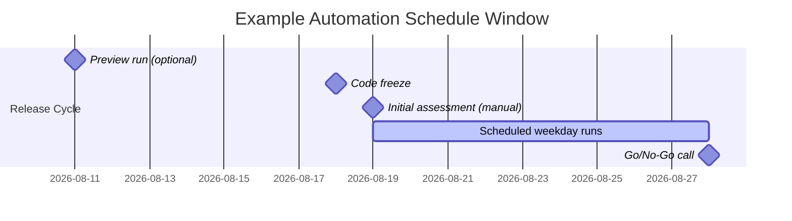

# Release Health Automation Setup

This page documents how to configure a scheduled Release Health Analyst automation run in ROVO Studio, based on the current owner-operated setup. It complements `Studio Setup - Release Health Analyst`, which documents the agent's Studio configuration itself; this page documents the automation flow around it.

> **Important:** ROVO Studio automation configuration is a manual, human-performed action. Nothing in this repository or manual writes to Studio on your behalf. Use this page as a guide while you make the change yourself.

## Overview

Each release cycle uses one automation flow that:

1. Runs on a schedule (weekdays, ending near the Go/No-Go date).
2. Invokes the Release Health Analyst agent with prompt instructions pointing at the current release's canonical assessment page.
3. Publishes the result as a new child page under that canonical page.

The simplest way to set up a new release's automation is to **duplicate the previous release's flow** and update the release-specific fields, rather than build one from scratch.

## Creating Initial Assessment

Before configuring the schedule, run one manual assessment first (see [Running a Manual Release Assessment](release-health-analyst-user-guide-manual-assessment.md)) and publish it as a normal Confluence page. This becomes the **canonical assessment page** that the automation will attach child runs to.

> **Recommendation:** Consider running an additional preview assessment about one week before code freeze to surface likely carryover items early, in addition to the code-freeze-day initial assessment.

## Creating Scheduled Assessment Runs

- [ ] Locate the previous release's automation flow in ROVO Studio Automations.
- [ ] Confirm the previous flow is disabled/expired (turn it off if it is still enabled) so it doesn't keep running.
- [ ] Duplicate that flow.
- [ ] Rename it for the current release (for example, from "August" to "September").
- [ ] Re-authenticate the agent connection if prompted — this is a common step after duplicating a flow.

### Updating Release-Specific Fields

Update these fields in the duplicated flow's prompt instructions and publishing configuration:

| Field | What to set it to |
| --- | --- |
| Release ID | The current release identifier (for example, `9.04`). |
| Fixed Version | The current release's exact fixVersion value. |
| Canonical Assessment Page | The newly created initial assessment page for this release. |
| Previous Draft Reference | "The most recent child page under the canonical assessment page with title containing Release Health and the current release identifier." |
| Page Publishing Configuration | Parent page set to the canonical assessment page; page title pattern updated to the current release. |

> **Important:** Keep the `Use agent` step's "allow agent to execute actions" setting disabled/`false`. The agent should return copy-ready content only; publishing happens through a separate, deterministic `Publish new page` automation action using `{{agentResponse}}` as the body. This keeps the write step auditable and out of the agent's own hands.

> **Caveat:** The prompt instructions are not exhaustive out of the box — owners have found that some behaviors (for example, consistently maintaining the trend table across reruns) need ongoing refinement. Review the current prompt text against [Automation Field Reference](release-health-analyst-user-guide-automation-field-reference.md) before assuming it's complete.

## Scheduling Guidance

- **Initial run:** the day after code freeze (manual kickoff), or one week before code freeze as an additional preview run.
- **Recurring runs:** daily, Monday through Friday.
- **Run time:** approximately 30 minutes before the Release Readiness meeting, so the freshest status arrives with review time to spare.
- **End date:** end the schedule on or just before the Go/No-Go date. A manual run is still possible on Go/No-Go day itself if needed.

## Configuration Checklist

- [ ] Previous release's flow duplicated and renamed.
- [ ] Agent connection re-authenticated.
- [ ] Release ID updated.
- [ ] Fixed Version updated.
- [ ] Canonical Assessment Page reference updated.
- [ ] Previous Draft Reference pattern updated to the current release identifier.
- [ ] Publish target parent page confirmed as the current canonical assessment page.
- [ ] Page title pattern confirmed to include the timestamp/timezone convention.
- [ ] Start date set to the day after code freeze.
- [ ] Run days set to Monday-Friday.
- [ ] Run time set to ~30 minutes before the RR call.
- [ ] End date set on or just before the Go/No-Go date.
- [ ] Flow saved and enabled.

## Validation Checklist

- [ ] Trigger one manual run of the new flow and confirm it publishes as a child of the correct canonical page.
- [ ] Confirm the published page title includes the correct release identifier and timestamp.
- [ ] Confirm the fixVersion used in the run matches the team's Release filter/JQL.
- [ ] Confirm the previous release's flow is disabled, not just superseded.
- [ ] Confirm the schedule's end date does not run past the Go/No-Go date.

## Feedback and Improvement Opportunities

Please submit agent improvement suggestions, false positives, missing findings, new reporting requirements, and automation enhancement ideas to the [Continuous Improvement Backlog](release-health-analyst-user-guide-improvement-backlog.md).
