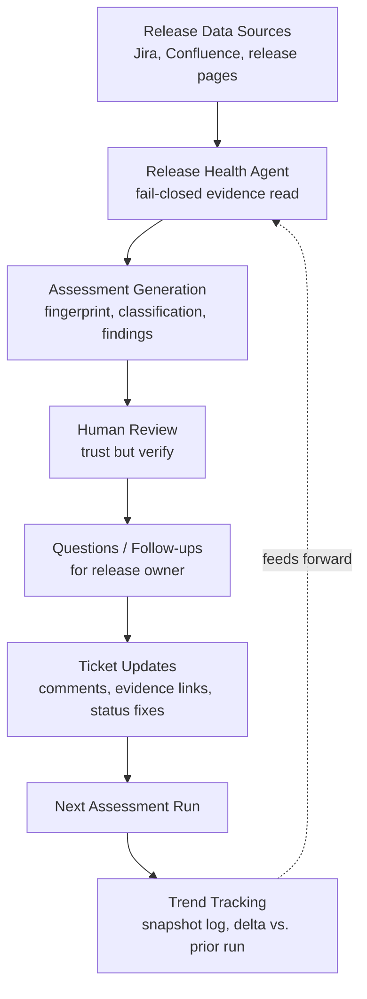
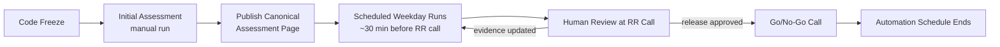

# Release Health Assessment Workflow

This page shows the end-to-end Release Health Analyst process as a diagram, for release managers and administrators who want the whole flow at a glance.

## End-to-End Assessment Flow

## Scheduled Automation Loop

## Iterative Assessment Improvement

The workflow is intentionally circular, not one-shot. Each cycle around the loop is meant to make the next one better:

1. **Release Data Sources** are only as good as the ticket and documentation hygiene behind them — see [Best Practices](release-health-analyst-user-guide-best-practices.md).
2. **The Release Health Agent** reads that evidence and fails closed on anything missing or ambiguous rather than guessing.
3. **Assessment Generation** produces a fingerprinted, classified output — never a raw data dump.
4. **Human Review** is not optional; it's where "trust but verify" happens.
5. **Questions and Follow-ups** turn agent-identified gaps into concrete, ownable actions.
6. **Ticket Updates** close those gaps at the source — updating a ticket's history or status, not just the assessment page.
7. **The Next Assessment Run** reads the updated tickets and the previous run's fingerprint, so it builds on real progress instead of repeating the same questions.
8. **Trend Tracking** makes that progress (or regression) visible across the whole release cycle, not just in a single run.

> **Recommendation:** The single highest-leverage step in this loop is step 6 — closing the gap on the ticket itself, not just answering the agent in the assessment page. That is what makes the *next* run better without any manual re-explaining.

## Feedback and Improvement Opportunities

Please submit agent improvement suggestions, false positives, missing findings, new reporting requirements, and automation enhancement ideas to the [Continuous Improvement Backlog](release-health-analyst-user-guide-improvement-backlog.md).
