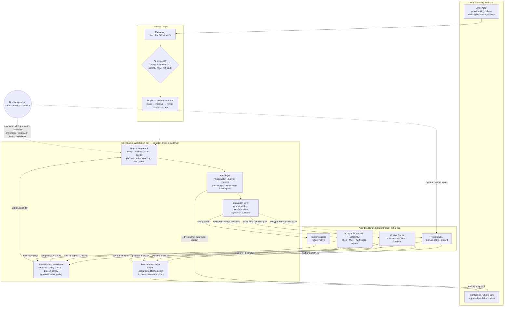

# Agent Governance Reference Architecture (Mermaid)

Date: 2026-07-08 · Companion to `enterprise-agent-governance-operating-model-2026-07.md`

Solid arrows = automated or tool-assisted (read-only or dry-run+approval). Dashed arrows = human-owned manual actions. No automated write path exists to any runtime.

Reading the diagram: Git holds intent and evidence; runtimes hold behavior; capture plus parity checks bridge the two; every consequential state change routes through the human approver node. Copilot is the one runtime where a supported Git path exists today, so its arrow is solid in both directions.
